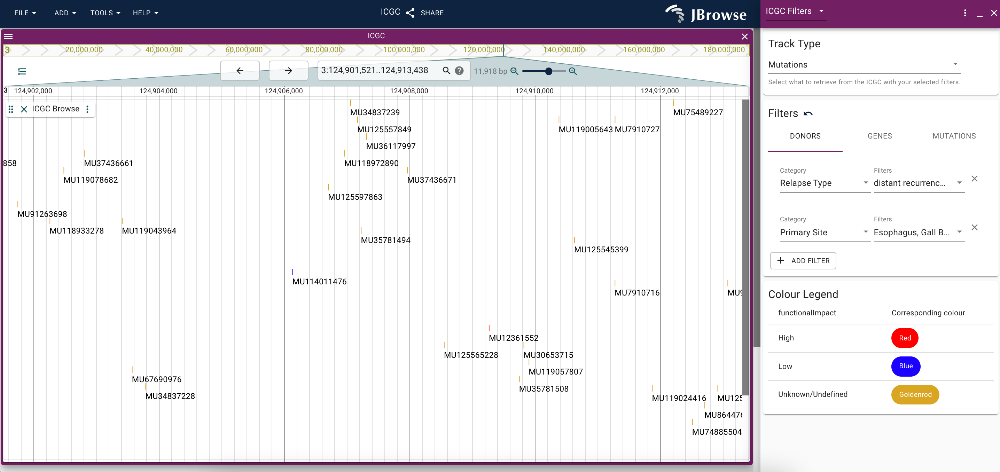

# jbrowse-plugin-icgc

> JBrowse 2 plugin for the International Cancer Genome Consortium ([ICGC](https://dcc.icgc.org/))



## Install

### For JBrowse Web and JBrowse Desktop

Install the ICGC Plugin through the in-app plugin store. Need some help? Check out [the guide on how to use the plugin store here](https://jbrowse.org/jb2/docs/user_guide/#using-the-plugin-store).

## Usage

### Development

```
git clone https://github.com/GMOD/jbrowse-plugin-icgc
cd jbrowse-plugin-icgc
yarn
yarn start
```

Then (assuming JBrowse Web is running on port 3000) open JBrowse Web to the following:

http://localhost:3000/?config=http://localhost:9000/config.json

Need help getting JBrowse Web running? [Read the docs here](https://jbrowse.org/jb2/docs/quickstart_web).

### Production

Add to the "plugins" of your JBrowse Web config:

```json
{
  "plugins": [
    {
      "name": "ICGC",
      "url": "https://unpkg.com/jbrowse-plugin-icgc/dist/jbrowse-plugin-icgc.umd.production.min.js"
    }
  ]
}
```
